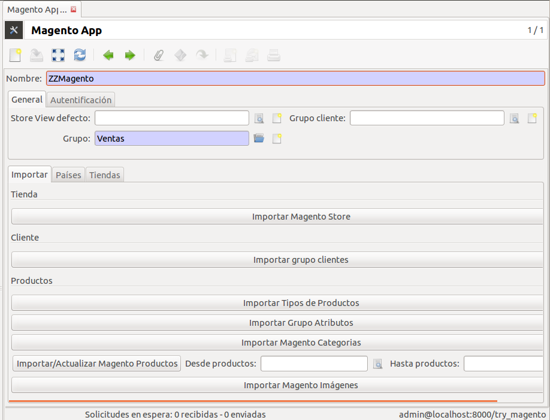

#:before:magento/magento:section:pedidos#

.. inheritref:: magento/magento:section:productos

Productos
=========

La exportación de productos de Magento a Tryton se realiza dentro de las opciones
de la tienda o por cada producto individualmente.

.. inheritref:: magento/magento:section:exportacion_de_productos

Exportación de productos
========================

Consulte la documentación del módulo
`productos de comercio electrónico <../esale_product/index.html>`_ para la
gestión de los productos y su exportación de Tryton a Magento.

.. inheritref:: magento/magento:section:importacion_de_productos

Importación productos
=====================

Para importar productos de Magento a Tryton abra el menú |menu_magento_app| y
en la pestaña **Importar** verá los botones de importación de Magento a Tryton
siguientes:

.. |menu_magento_app| tryref:: magento.menu_magento_app_form/complete_name

* Importar tipos de productos (simple, configurable, ...). Posteriormente, a 
  través del menú |menu_magento_product_type|\ , podrá activar con que
  productos trabaja. Este campo es requerido.
* Importar grupo de productos (default,...) que haya definido en Magento. Este
  campo es requerido.
* Importar Magento Categorías. Importa el árbol de navegación de Magento. Si la categoría
  ya existe al ERP, esta se actualizará con los datos de Magento. En el caso que desea
  eliminar una categoría, a parte de que no se recomienda por no obtener el mensaje de
  "Error 404 Not Found", puede marcar la opción "Activo" a "No" para que no esté disponible.
* Importar/Actualizar Productos Magento. Importa o actualiza los productos que disponga en el ERP
  con los productos que importe del catálogo de Magento. En catálogos de muchos productos,
  esta importación se debe realizar por intervalos de fechas o por rango de IDs. Puede hacerlo
  cada 500 o 1000 productos. Revise los logs del sistema.
  Antes de importar nuevos productos, debe importar las nuevas categorías que haya creado desde
  la última importación. En el caso que una categoría no se encuentre a Tryton no se dispondrá
  en el producto.
  En la importación de productos también importará las traducciones y las imagenes.
  Para las traducciones debe especificar en Magento APP los idiomas que corresponden a la vista
  de la tienda de Magento.
  Para las imagenes, antes de crear una nueva imagen, se buscar si en la plantilla de producto
  ya dispone de un imagen por el nombre de la imagen. La imagen que se importa se dispone como adjunto
  en el producto (se guarda al disco duro del servidor Tryton).
* Importar links de productos. Actualiza los productos importados con los productos
  Ventas cruzadas, Ventas sugeridas y Productos relacionados. Antes de importar nuevos links de productos,
  debe importar los nuevos productos que haya creado desde la última importación. En el caso que 
  una producto no se encuentre a Tryton no se dispondrá como link en el producto.

.. |menu_magento_product_type| tryref:: magento_product.menu_magento_product_type_form/complete_name

.. inheritref:: magento/magento:section:importacion_de_atributos

Importación de atributos
========================

En Magento APP dispone de la importación de atributos:

* Importar grupo de atributos: Importa el grupo de atributo.
* Importar opciones de atributos: Importa las opciones en los campos selección
  de los atributos de producto de Magento a Tryton.

No se dispone de ninguna importación de atributos para evitar crear atributos que no
sean necesarios al ERP. Después de importar los grupos de atributos, deberá crear
los atributos que desea gestionar a Productos/Atributos. En el caso de los atributos
del tipo "selección" puede importar las opciones mediante el botón "Importar opciones de atributos".

Recuerde que si estos atributos desean después importar/exportar entre Tryton <-> Magento deberá
crear el tipo de mapeo que se va realizar entre los campos del ERP y los campos de Magento.
